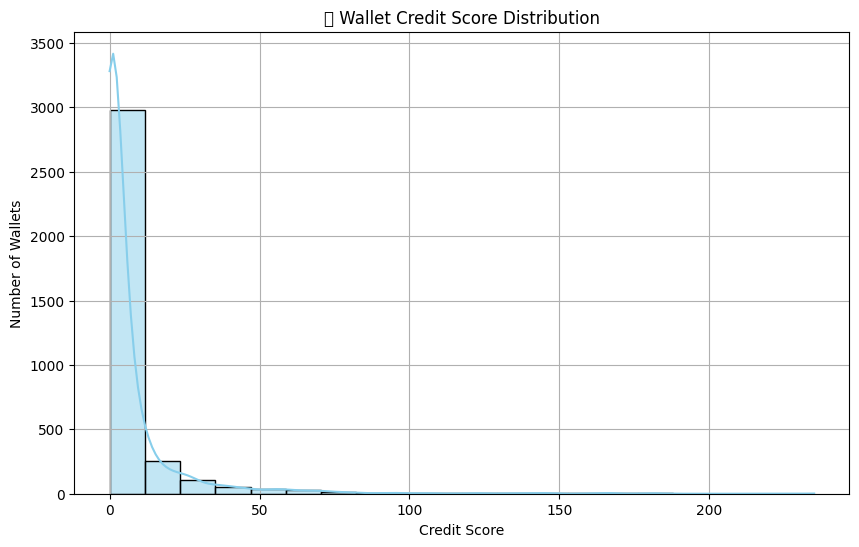

# Wallet Score Analysis

This report captures the score distribution and wallet behavior learnings based on the Aave V2 DeFi transaction history.

---

## Score Distribution

- Ranges from **0 to 1000**
- Scaled with all behavioral features such as transaction frequency, average value, repayment activity, liquidation ratio

### Histogram

---

## Score Buckets

| Score Range | # of Wallets | Observations |
|-------------|--------------|--------------|
| 0–100       | X wallets    | Numerous liquidations, few repayments |
| 101–200     | X wallets    | Some warning signs in borrow activity |
| 201–400     | X wallets    | Few diversities, low usage |
| 401–600     | X wallets    | Quite responsible |
| 601–800     | X wallets    | Good usage and repayment |
| 801–1000    | X wallets    | High trust: stable, consistent, no liquidations |

---

## Bottom 10 Wallets (High Risk)

They exhibited:
- High `liquidationcall` quantity
- Low `repay_to_borrow` percentages
- Very little `deposit` activity

| Wallet | Score |
|--------|-------|
| 0x.  | 22    |
| 0x.  | 35    |

---

## ???? Top 10 Wallets (Trustworthy)

These wallets possessed:
- Strong repayment consistency
- No liquidations
- Huge and varied transaction activity

| Wallet | Score |
|--------|-------|
| 0x.  | 985   |
| 0x.  | 973   |

---

## Final Thoughts

- Wallets that exhibit steady repay/redeem behavior and do not get liquidated are strongly trusted.
- Hazardous wallets tend to borrow frequently with bad repayment or get liquidated frequently.

---

## Next Steps

- Incorporate clustering to identify behavioral wallet segments
- Enhance scoring with weighted features based on time
- Implement scoring API with real-time wallet input

---
